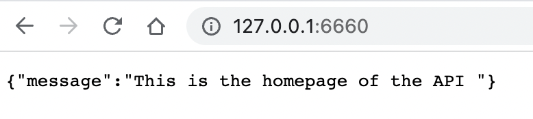
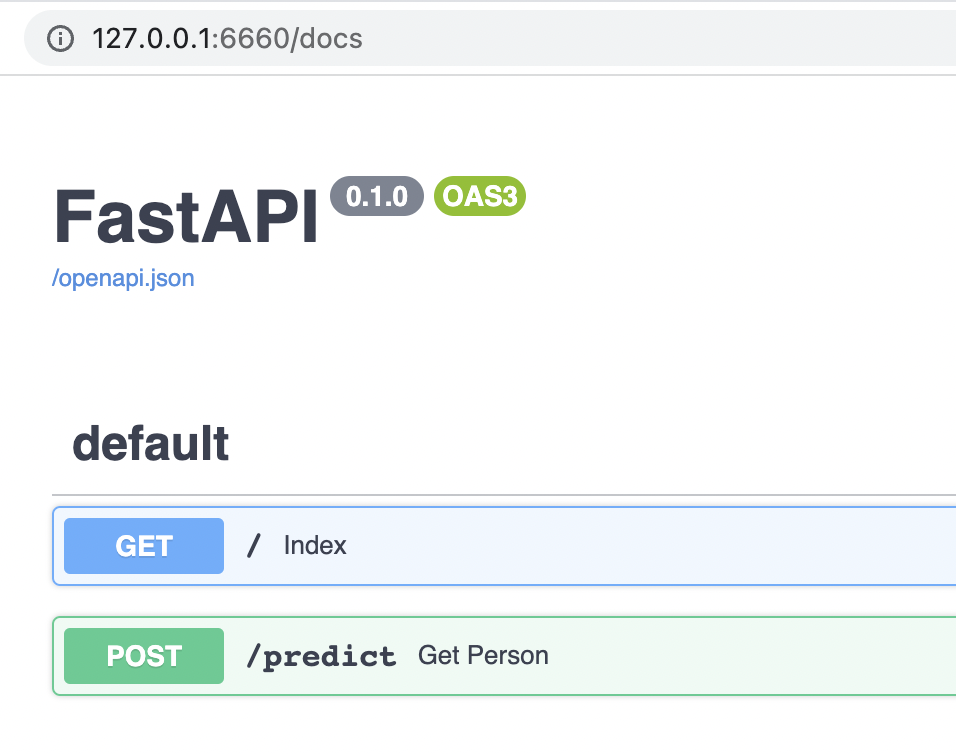
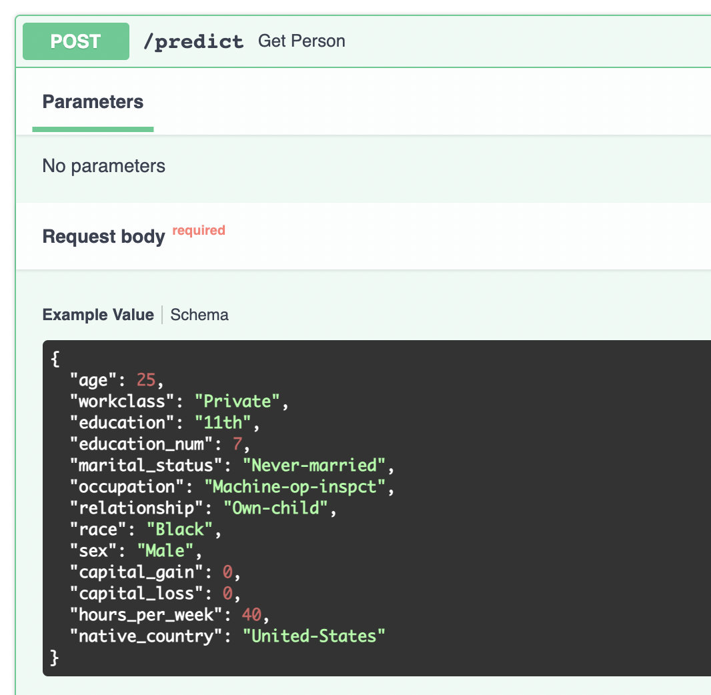
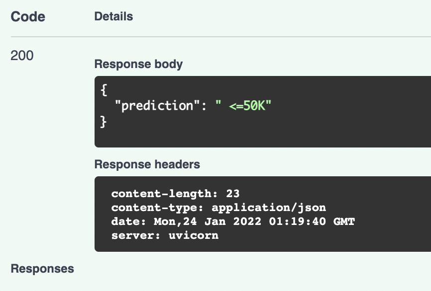
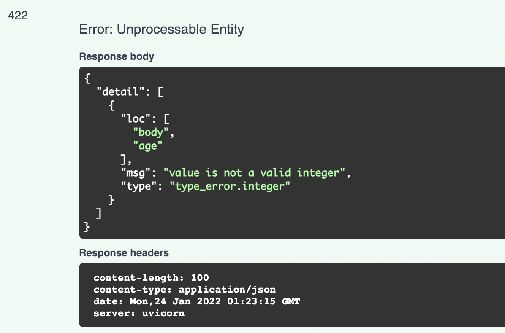
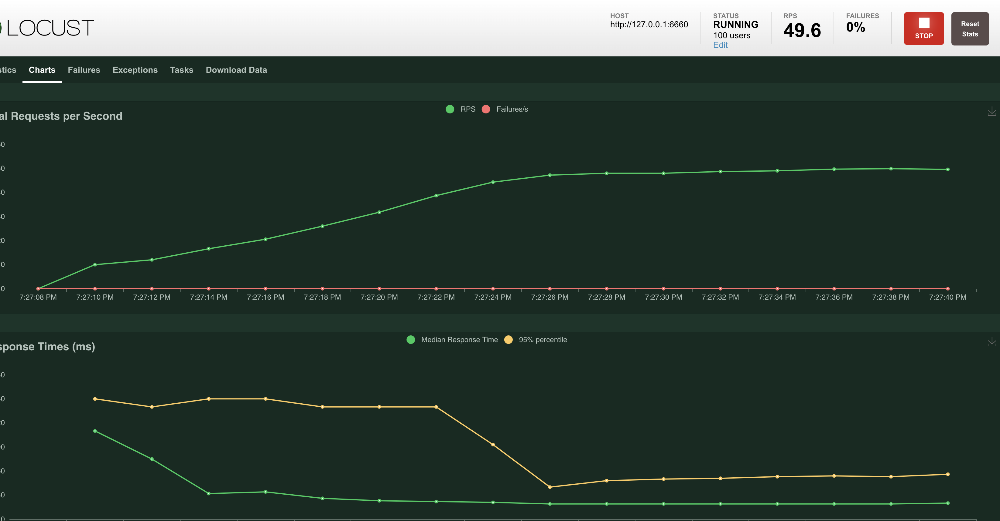

# Income Detection Model Training and Deployment

This repository trains and deploys machine learning model for census data income detection. The dataset can be found here: <https://archive.ics.uci.edu/ml/datasets/Census-Income+(KDD>)

The target variable is "income", indicating whether the person's income is above $50k or below $50k.

## Directory Explanation

The file structure looks like the following:

```
+--- [app]
|    |
|    +--- person.py
|    +--- sklearn_income_classifier.pkl
|    +--- main.py
|    +--- catboost_income_classifier.cbm
+--- [assets]
|    |
+--- [test]
|    |
|    +--- perf.py
|    +--- api_test.py
+--- [train]
|    |
|    +--- [data]
|    |    |
|    |    +--- adult.data
|    |    +--- adult.names
|    |    +--- adult.test
|    +--- catboost_model_training.py
|    +--- helper.py
|    +--- sklearn_model_training.py
|    +--- explore.py
|    +--- evaluate.py
+--- deployment.yaml
+--- requirements.txt
+--- Dockerfile
+--- README.md
+--- .gitignore
```

### / (_the main directory_)

- `Dockerfile` to containerize the fast api app
- `deployment.yaml` deployment file for Kubernestes.
- `requirements.txt` file for python package requirements

### /app

this is the fast api related code

- `main.py`: main fast api code
- `person.py`: data validation model
- `catboost_income_classifier.cbm`: catboost model cbm file
- `sklearn_income_classifier.pkl`: sklearn model pickle file (not used with fast api)

### /assets

image files for this README

### /test

test related code, such as api test and load test

- `perf.py`: file to perform load test
- `api_test.py`: file to perform api request test

### /train

training related code

- `catboost_model_training.py`: catboost model training code
- `sklearn_model_training.py`: sklearn model training code
- `explore.py`: code for eda and visualization
- `evaluate.py`: code for model evaluation
- `helper.py`: helper functions for model training and visualization
- `/data`: training data files

## Instructions

### 1\. Training

Training related files are under the `/train` folder. For training the model, catboost_model_training.py can be used. Helper function download_census_data downloads and saves the data under data folder. Then the scripts builds catboost classification model. Then, we add model columns into the model and save the model to the "app" folder.

Additionally, one can explore and evaluate the data using the explore.py and evaluate.py files.

If you want to fit a sklearn model with a pipeline, you can use sklearn_model_training.py.

### 2\. Deployment

Most deployment related files are under the `/app` folder.

if you want to run fast api directly without Docker or Kubernestes, run the following:

```
cd income_detection_api
python -m venv env
source env/bin/activate
pip install -r requirements.txt
cd app
pyton main.py
```

To containerize it with Docker and serving it, run the following:

```
docker buildx build --platform=linux/amd64 -t myimage .
docker run -d --platform=linux/amd64 --name mycontainer -p 8000:8000 myimage
```

I have also uploaded the image to Docker Hub. The link is here: <https://hub.docker.com/repository/docker/ybaktir/income_detection>

To orchestrate with Kubernestes:

```
minikube start
kubectl apply -f deployment.yaml
```

Trouble shooting for Kubernestes:

```
kubectl get services  #to check the status
minikube tunnel       #to open up the port for the load balancer

kubectl run -it --rm --restart=Never busybox --image=gcr.io/google-containers/busybox sh
# to log into a specific pod and doing curl
kubectl run curl-image --image=radial/busyboxplus:curl -i --tty --rm curl 10.100.247.207:6000

# sometimes the relevant port gets blocked by the system
# to get around that I do port-forwarding with this code
kubectl port-forward service/income-detection-service 6600:6000
```

to get around the port already is use problem, you can kill process that uses the port of interest

```
kill -9 $(lsof -ti:6000)
```

### 3\. Testing

for load testing:

```
cd test
locust -f perf.py
```

Also, for simple python requests you can use `api_test.py`

# Visuals

When the app is up and running, one should see the following visuals.

## main page



## FastAPI documentation



## FastAPI sample request



## Successful Response



## Validation Control



## Load Test


